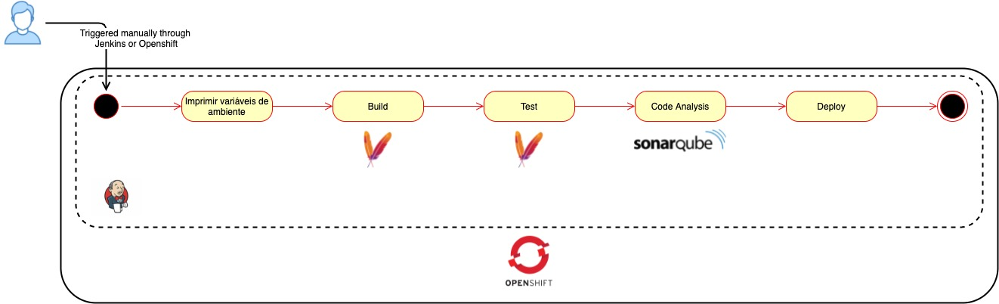

# Pipeline CI/CD Jenkins to SpringBoot microservice deployed in Openshift

## Architecture


## Steps to create the pipeline
Login into the Openshift.
```
oc login --server=<openshift_cluster_url_login>
```

Create a new namespace to host Jenkins, Sonarqube and thereby the pipeline.
```
oc new-project <namespace_name>
```

Execute the following command in order to create the BuildConfig object which is responsible to download the pipeline source code.
```
oc create -f build-config/pipeline-build-config.yaml
```